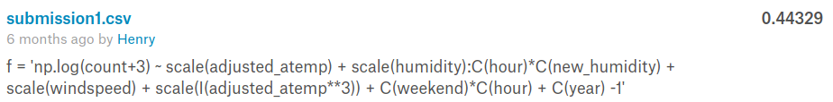
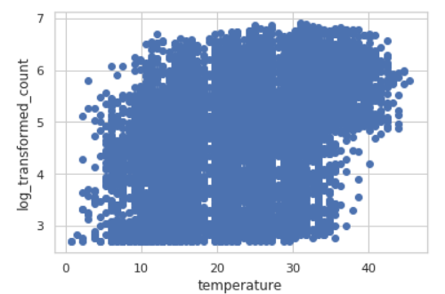
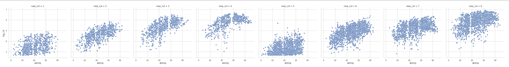

# Bike Sharing Demand: by linear regression
- Kaggle: https://www.kaggle.com/c/bike-sharing-demand
- Result

## Data Fields 
- datetime - hourly date + timestamp
- season -  1 = spring, 2 = summer, 3 = fall, 4 = winter 
- holiday - whether the day is considered a holiday
- workingday - whether the day is neither a weekend nor holiday
- weather 
	- 1: Clear, Few clouds, Partly cloudy, Partly cloudy 
	- 2: Mist + Cloudy, Mist + Broken clouds, Mist + Few clouds, Mist 
	- 3: Light Snow, Light Rain + Thunderstorm + Scattered clouds, Light Rain + Scattered clouds 
	- 4: Heavy Rain + Ice Pallets + Thunderstorm + Mist, Snow + Fog 
- temp - temperature in Celsius
- atemp - "feels like" temperature in Celsius
- humidity - relative humidity
- windspeed - wind speed
- casual - number of non-registered user rentals initiated
- registered - number of registered user rentals initiated
- count - number of total rentals

## Key concept: Interaction between features
- eg. re-categorized hour category \* temperature 
- x axis: temperature 
- y axis: log transformed count(y) 

<h3>No Interaction</h3>

<h3>No Interaction</h3>

